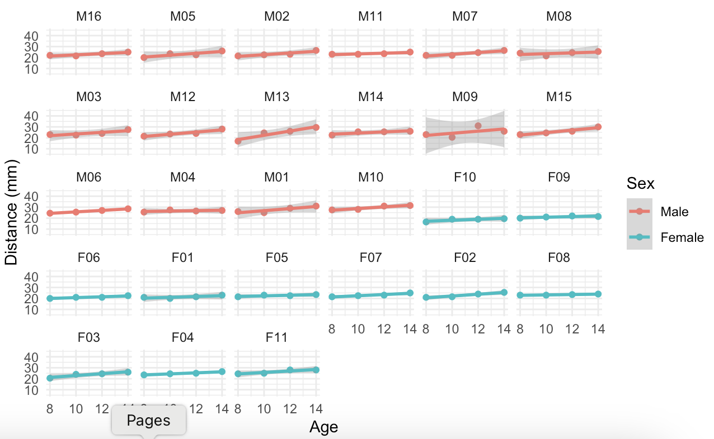
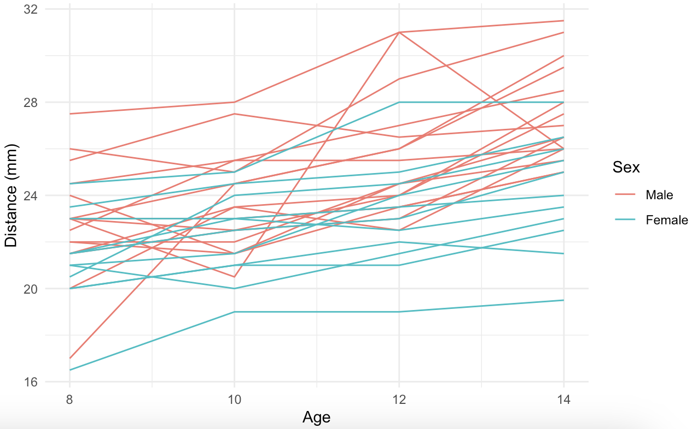

# Craniofacial Growth Analysis Using Mixed-Effects Models

## Project Summary

This project provides a comprehensive analysis of craniofacial development during childhood and adolescence using longitudinal data from the Orthodont dataset. By estimating linear mixed-effects models, the study examines growth trajectories and quantifies systematic differences across individuals, with particular focus on gender-specific patterns. The analysis highlights variations in both baseline measurements and growth rates.

## Features

- **Exploratory Visualization:** Visualizes individual growth profiles and overlays trajectories by gender.
- **Mixed-Effects Modeling:** Implements two linear mixed-effects models—one with random intercepts and another with both random intercepts and slopes.
- **Gender-Specific Estimation:** Separates models by gender to explore differences in growth levels and trends.
- **Statistical Interpretation:** Presents parameter estimates and variance components to illustrate both fixed and random effects.

## Technologies Used

- **R:** Main programming environment for analysis and modeling.
- **nlme:** Package for fitting linear and nonlinear mixed-effects models.
- **ggplot2:** Visualization library used for generating exploratory plots.
- **dplyr:** Data wrangling package used to prepare gender-specific subsets.

## How to Use

1. **Download the Script:** Get the `.R` script file included in this repository.
2. **Open in RStudio:** Open the script in an R environment such as RStudio.
3. **Run the Code:** Execute the code chunks to view visualizations and model outputs.
4. **Interpret Results:** Review the summary statistics and model diagnostics to explore growth patterns.

## Example Showcase

### Figures Included:

- **Figure 1:** Individual Craniofacial Growth Profiles by Subject and Gender

- **Figure 2:** Overlaid Craniofacial Growth Trajectories by Gender

### Key Results:

- Estimated average growth rate: **0.66 mm/year**
- Males show higher growth rates and greater heterogeneity
- Females exhibit more consistent trajectories with higher baseline distances

## Conclusion

This project applies flexible statistical techniques to model individual growth trajectories based on longitudinal data. While the dataset pertains to craniofacial development, the analytical approach—particularly the use of linear mixed-effects models—can be broadly applied to study patterns of change over time and variability across individuals. The findings offer insights into how structured modeling frameworks can uncover systematic differences in developmental data across groups.
