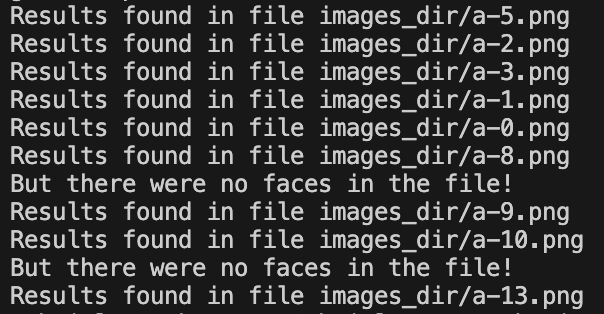

# Image Processing and OCR Project

## Overview

Welcome to the Image Processing and OCR Project! It involves processing a zip file containing multiple images, extracting text from each image, and detecting faces in images that contain a specified word. The detected faces are then displayed in a contact sheet format.

## How It Works

1. **Unzip and Process Images:** Extract images from a provided ZIP file.
2. **Keyword Search with OCR:** Use Pytesseract to find specific keywords in the images.
3. **Face Detection:** Use OpenCV to detect faces on the pages where keywords are found.
4. **Create Contact Sheets:** Compile all detected faces into contact sheets using Pillow.

## Key Features

- **Interactive Searches:** Find any keyword in the newspaper images and see all related faces.
- **Efficient Processing:** Handle large files and multiple images seamlessly.
- **Visual Output:** Get clear and organized contact sheets of detected faces.

## Technologies Used

- **Zipfile:** For handling zip file operations.
- **Pillow (PIL):** For image processing and creating contact sheets.
- **OpenCV:** For detecting faces in the images.
- **Pytesseract:** For performing Optical Character Recognition (OCR) to extract text.
- **numpy:** For array operations.

## Example Use Case

- **Search for "Mark":** View all faces on pages mentioning "Mark", even if some pages don’t have faces.

## Why Use This Tool?

- **Save Time:** Quickly find and analyze specific content in large sets of images.
- **Improve Insights:** Visualize data more effectively with contact sheets of detected faces.
- **Easy to Use:** Simply unzip, search, and view results!

