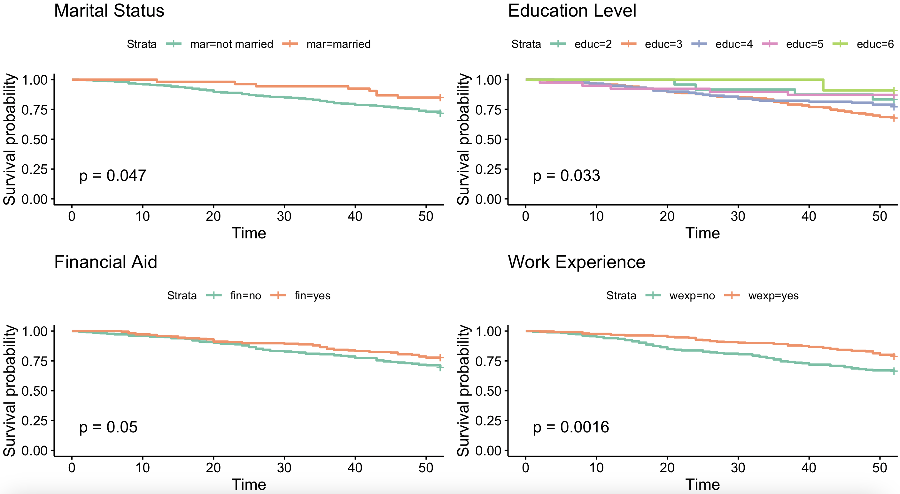
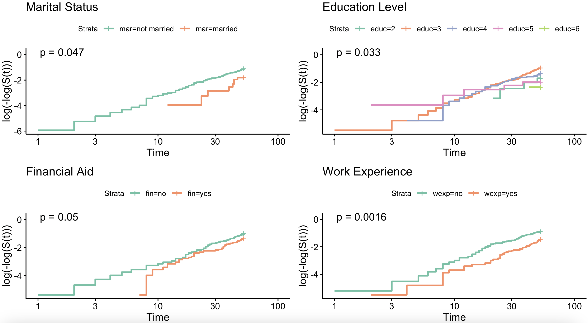
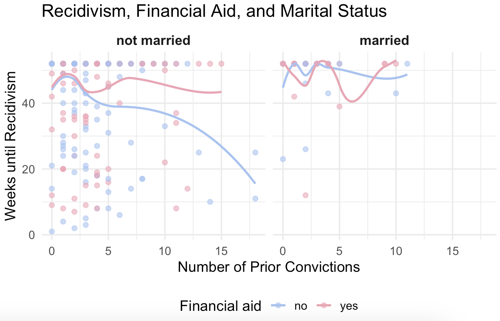

# Survival Analysis of Recidivism

## Overview

This project examines the timing of recidivism among individuals recently released from incarceration using survival analysis techniques in R. It combines both exploratory and statistical modeling approaches—such as Kaplan-Meier curves, log-rank tests, and Cox proportional hazards models—to identify which individual characteristics are most strongly associated with the risk and timing of reoffending.

## How It Works

1. **Data Preparation:** Load and clean data from a study tracking 432 men for one year following their release.
2. **Exploratory Analysis:**  Use summary statistics, boxplots, and LOESS-smoothed scatterplots to examine time to recidivism across key variables.
3. **Survival Modeling:**
   - Apply the log-rank test to assess group differences in survival.
   - Estimate Kaplan-Meier curves for descriptive visualization of survival probabilities.
   - Fit a Cox proportional hazards model to analyze the impact of multiple predictors simultaneously.
4. **Assumption Testing:** Use Schoenfeld residuals to assess whether the proportional hazards assumption holds.

## Key Features

- **Detailed Variable Insights:** Examine how factors such as financial aid, marital status, work experience, and prior convictions influence the timing of reoffending.
- **Model Refinement:** Compare a full Cox model with a reduced model that includes only statistically significant predictors.
- **Visual Diagnostic:** Use both Kaplan-Meier curves and complementary log-log plots to evaluate model assumptions and survival behavior.

## Technologies Used

- **R** (with libraries like `survival`, `survminer`, `ggplot2`, `dplyr`)
- **Kaplan-Meier Estimator** for non-parametric survival curve estimation.
- **Cox Proportional Hazards Model** multivariate regression for survival time.
- **Schoenfeld Residuals** for assumption checking.
- **LOESS smoothing** for visualizing continuous predictor.

## Example Use Case

**Compare Recidivism Across Groups:** Visualize how the timing of reoffending varies by key characteristics such as marital status, financial aid, education level, and prior work experience.

→ Displayed through Kaplan-Meier survival curves for each variable with statistically significant differences.

**Assess Model Assumptions Visually:** Evaluate whether the proportional hazards assumption holds across subgroups.

→ Supported by complementary log-log plots, which help detect non-proportional hazards over time.

**Explore Continuous Predictors and Interactions:** Examine how the number of prior convictions relates to recidivism timing, and how that relationship changes across marital status and financial assistance groups.

→ Illustrated using smoothed LOESS scatterplots for both main effects and interactions.

## Why This Analysis?

- **Robust and Interpretable:** Survival analysis provides a powerful framework for understanding when and why recidivism occurs.
- **Evidence-Based:** Supports nuanced understanding of how individual characteristics shape post-release trajectories.
- **Extensible Framework:** Can be adapted to other time-to-event contexts beyond recidivism.